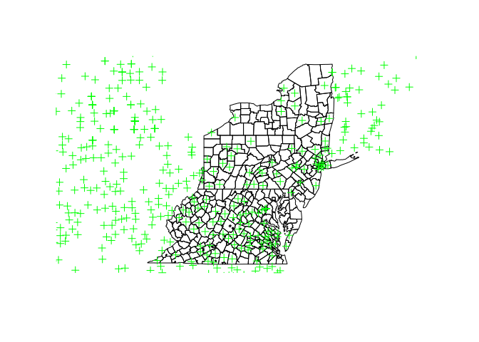
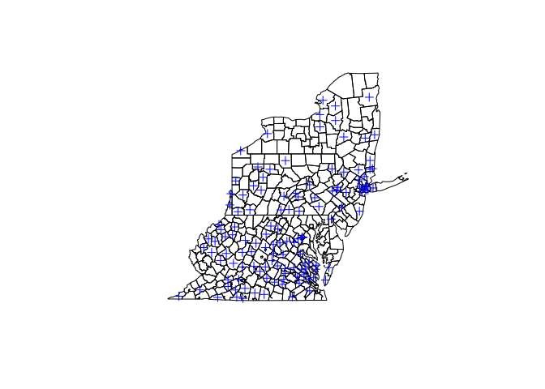
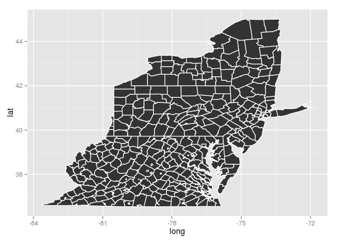
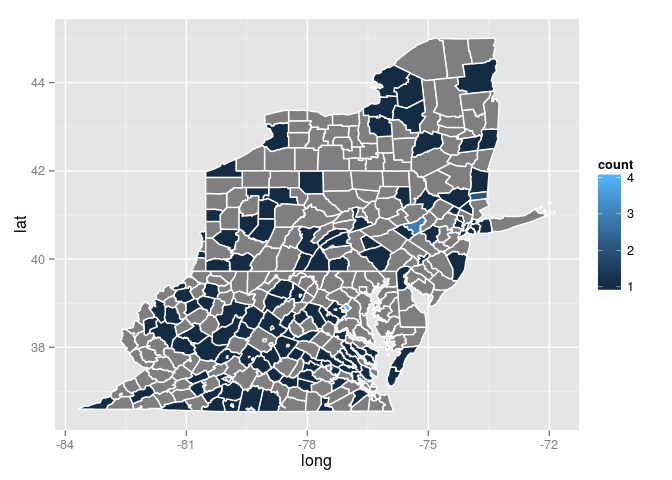

Geospatial analysis in R
========================

This is a short presentation of some of the key R packages for geospatial analysis. Together, they provide efficient open-source solutions for a range of common spatial processing tasks, such as: loading vector (points, lines and polygons) or raster (grids of pixels) data from various source formats, performing geometrical operations (union, intersection, buffering) on spatial objects, converting map projections, computing geodesic distances, or displaying spatial data on a web-based map engine (e.g. Google Maps, Open Street Map).

The R scripting approach to geospatial analysis may initially seem inconvenient or unintuitive, compared to the point-and-click interface of GIS software. However, the additional effort of coding all the steps of an analysis workflow makes it much easier for anyone - including the code's author - to reproduce the same analysis on new or updated data. R scripts can also serve to automate and distribute large processing tasks in a high-performance computing environment (such as SESYNC's SLURM cluster).

Spatial data types
------------------

The **sp** package defines the basic types of spatial data and constitutes a prerequisite for most of the R spatial packages. We begin by loading **sp** and creating a *SpatialPointsDataFrame* that contains the locations of *Ambrosia artemisiifolia* records obtained from the BISON database (see the "Getting data from the web" session).

``` r
library(sp)

load("bison_out.RData")
ambrosia <- bison_out$points
ambrosia <- SpatialPointsDataFrame(coords = ambrosia[,2:3], 
                                   data = ambrosia[,c(1,4:6)],
                                   proj4string = CRS("+init=epsg:4326"))
```

When creating the spatial object, we identified the two coordinate columns from our data frame, additional data columns to include, as well as the geographic projection (ESPG code 4326 corresponds to WGS 84 latitude/longitude coordinates). This information can be retrieved from the *ambrosia* object through its components (called "slots") `ambrosia@coords`, `ambrosia@data` and `ambrosia@proj4string`, respectively.

*Note*: The reason why we use "@" rather than "$" to access parts of this object has to do with object-oriented programming systems in R and is beyond the scope of this lesson. However, you can always look at the structure of an object in the RStudio "Environment" tab to know which of the two character applies.

To show how to overlay our point data on another spatial layer, we will use a shapefile of US county boundaries. Run the code below to download and unzip the files in a *cb\_2014* folder in your home directory. The `system` function in R is equivalent to typing commands in the operating system's command prompt or terminal. These are Linux commands, as the SESYNC RStudio Server runs on Linux.

``` r
system("wget http://www2.census.gov/geo/tiger/GENZ2014/shp/cb_2014_us_county_5m.zip")
system("mkdir cb_2014")
system("unzip cb_2014_us_county_5m.zip -d cb_2014")
```

The **rgdal** package provides an interface to the Geospatial Data Abstraction Library (GDAL), enabling R to import spatial data stored in different formats. Note that to use this package on your personal computer, you need to first [install GDAL](http://trac.osgeo.org/gdal/wiki/DownloadingGdalBinaries). We import the county boundaries shapefile into R with the `readOGR` function:

``` r
library(rgdal)
counties <- readOGR("cb_2014/cb_2014_us_county_5m.shp", 
                    layer = "cb_2014_us_county_5m")
```

    ## OGR data source with driver: ESRI Shapefile 
    ## Source: "cb_2014/cb_2014_us_county_5m.shp", layer: "cb_2014_us_county_5m"
    ## with 3233 features
    ## It has 9 fields

The output is a *SpatialPolygonsDataFrame*. By exploring its structure in the Environment tab in RStudio, we see it has a `@polygons` slot containing a list of 3233 *Polygons* objects, as well as `@data` and `@proj4string` slots just like the *SpatialPointsDataFrame*. By associating spatial features with rows in a data table, the *Spatial...DataFrame* objects are similar to the map layers in a GIS software like ArcGIS. The related classes *SpatialPoints* and *SpatialPolygons* store only the spatial features, without attached data.

Each of the *Polygons* object in a *SpatialPolygons* or *SpatialPolygonsDataFrame* contains one or more *Polygon* objects, which are simple polygons in the geometric sense; a single *Polygons* object can thus be a complex shape combining many polygons with holes in them. The `@coords` slot of a *Polygon* is a matrix with the (*x*,*y*) coordinates of each vertex, with the first and last vertices being identical to form a "closed" shape.

Although we do not demonstrate them here, the *SpatialLines* and *SpatialLinesDataFrame* data types follow a similar structure. You can convert a polygon layer *polys* to its constituent lines with the `as` function: `poly_lines <- as(polys, "SpatialLines")`.

We can subset spatial data frames just like regular R data frames. Here we use this feature to keep only the polygons corresponding to Mid-Atlantic states.

``` r
mid_atl <- c(10, 11, 24, 34, 36, 42, 51, 54) # FIPS codes for DE, DC, MD, NJ, NY, PA, VA, WV
counties <- counties[counties@data$STATEFP %in% mid_atl, ]
```

To compare spatial objects, we need to first make sure they use the same coordinate reference system (CRS):

``` r
proj4string(ambrosia)
```

    ## [1] "+init=epsg:4326 +proj=longlat +datum=WGS84 +no_defs +ellps=WGS84 +towgs84=0,0,0"

``` r
proj4string(counties)
```

    ## [1] "+proj=longlat +datum=NAD83 +no_defs +ellps=GRS80 +towgs84=0,0,0"

The difference between the two CRS (see the "datum" and "ellps" parameters in the *proj4string*) means that their latitude and longitude coordinates do not exactly coincide. We call the `spTransform` function to convert the counties boundaries to the same CRS as the BISON data.

``` r
counties <- spTransform(counties, CRS(proj4string(ambrosia)))
proj4string(counties)
```

    ## [1] "+init=epsg:4326 +proj=longlat +datum=WGS84 +no_defs +ellps=WGS84 +towgs84=0,0,0"

Spatial plots and overlays
--------------------------

Loading the sp package automatically makes the base R `plot` function correctly handle spatial objects. To visualize multiple spatial layers in the same plot, specify `add = TRUE` in successive calls to `plot`:

``` r
plot(counties)
plot(ambrosia, col = "green", add = TRUE)
```



To find the county associated with each point in the *ambrosia* data, we perform a spatial overlay. (This is purely a learning example, as the county information was already present in the BISON data.)

``` r
counties_over <- over(ambrosia, counties)
```

The exact output of `over` depends on the types of the two spatial objects passed as arguments: see `?sp::over` for details. In this case, *counties\_over* is a data frame of 993 rows, one for each point in *ambrosia*. Each row contains the *counties* data corresponding to the county polygon that contains the point; it is filled with *NA* if the point is not contained in any polygon. We can use this fact to subset the *ambrosia* locations to those occurring in one of the Mid-Atlantic states.

``` r
ambrosia_subset <- ambrosia[!is.na(counties_over$NAME),]
plot(counties)
plot(ambrosia_subset, col = "blue", add = TRUE)
```



We repeat the overlay, this time converting *counties* to a *SpatialPolygons* object to ignore the associated data frame. The output is a vector with elements corresponding to the index of the polygon in *counties* containing each point in *ambrosia*, or *NA* when no polygon contains the point.

``` r
counties_over <- over(ambrosia, as(counties, "SpatialPolygons"))
```

Next, we create a choropleth map with colors indicating the number of common ragweed specimens by county. As we saw previously, this functionality is already included in the **rbison** package; there are also other R packages specialized for producing choropleth maps. However, here we will demonstrate how to include spatial data in **ggplot2** graphics. This can be useful when you need to create custom maps requiring the high level of control over plot details that ggplot provides.

To get the count of specimens by county, we tabulate the occurrence of each county index in *counties\_over* using the R function `table`, then convert the result to a two-column data frame:

``` r
ambrosia_counts <- as.data.frame(table(counties_over))
colnames(ambrosia_counts) <- c("id", "count")
ambrosia_counts$id <- as.character(ambrosia_counts$id)
head(ambrosia_counts)
```

    ##   id count
    ## 1  2     1
    ## 2 10     1
    ## 3 14     1
    ## 4 18     1
    ## 5 23     1
    ## 6 24     1

At the moment the *id* column in *ambrosia\_counts* matches the order of the polygon in *counties* (from 1 to 366), but not the *ID* of the polygon. For example, the *ID* of the first county polygon is "4": this is because the layer only represents a subset of the whole US county boundaries data we originally imported. Fortunately, changing the IDs of a whole layer can be done through a single call to the `spChFIDs` function:

``` r
counties <- spChFIDs(counties, as.character(1:length(counties)))
```

We are now ready to create our choropleth map. The key function for making spatial data types compatible with ggplot2 is `fortify`.

``` r
library(ggplot2)
counties_fort <- fortify(counties)
```

As you can see from the structure of its output, `fortify` produces a data frame where each polygon is broken into its points; the *id* column indicates the polygon to which each point belongs. The additional columns (order, hole, piece and group) provide the necessary information for ggplot2 to properly display the spatial objects. We can then draw the polygons using standard `ggplot` syntax, by defining the aesthetic mappings (do not forget to group by the *group* column) and using `geom_polygon`.

``` r
ggplot(data = counties_fort, aes(x = long, y = lat, group = group)) +
  geom_polygon(col = "white")
```



How can we add the species occurrence counts to this data frame?

Since both *ambrosia\_counts* and *counties\_fort* have a *id* column corresponding to the polygon ID, a single join operation suffices. More specifically, we perform a `left_join` (from the **dplyr** package) to keep all the rows in *counties\_fort*, whether these counties have ragweed specimens or not.

``` r
library(dplyr)
counties_fort <- left_join(counties_fort, ambrosia_counts)
ggplot(data = counties_fort, aes(x = long, y = lat, group = group)) +
  geom_polygon(col = "white", aes(fill = count))
```



R packages for computations on spatial vector data
--------------------------------------------------

Now that you know the basics of representing points, lines and polygons in R, here are a few packages that you can use to perform complex computations on these spatial layers.

The Geometry Engine - Open Source (GEOS), a suite of high-performance C++ functions for geometric operations, can be accessed from R via the **rgeos** package. Some of the key functions of the rgeos package include:

-   gDistance: returns the nearest distance between any two spatial objects (i.e. point to point, point to line, line to polygon, etc.);

-   gBuffer: returns the spatial object with its boundaries increased or decreased by a certain buffer distance;

-   gUnion, gIntersection, gDifference: for two spatial objects, gUnion returns the portion of space that is covered by either of them, gIntersection returns the portion of space that is covered by both, and gDifference returns the portion of the first object not covered by the second.

The main caveat is that rgeos functions only deal with planar geometries, i.e. projected coordinates. If you have latitude and longitude coordinates and wish to calculate the geographical distances between points, taking into account the Earth's curvature, you can use the **geosphere** package instead. Beyond calculating distances, the functions in geosphere can be used to create geodesic lines (or great circles) joining two given points, or starting from a point with a given bearing. For a more detailed overview of the package, please consult its [vignette on CRAN](http://cran.r-project.org/web/packages/geosphere/vignettes/geosphere.pdf).

Working with raster data
------------------------

In this tutorial, we did not discuss raster layers, i.e. gridded/pixelized spatial data. Raster files such as those originating from satellite imagery can be several gigabytes in size. The **raster** package offers powerful tools to work with this type of data in R without having to load the complete layer in memory. Instead, when given an operation to perform on a raster file, it will load small portions of the file at a time, process them and save the result back on disk. Some of the operations handled by the raster package include:

-   clipping a raster to a certain boundary or to match the extent of a different raster;
-   subsetting / masking: picking values from one raster based on the values in the corresponding cells of another raster;
-   adding or averaging corresponding cell values across different raster layers;
-   spatial aggregation: combining nearby values in a raster to produce a raster with lower resolution;
-   resampling: interpolating values in a raster to the grid points of another raster.

For more details, please consult the raster [vignette in CRAN](http://cran.r-project.org/web/packages/raster/vignettes/Raster.pdf).

Additional references
---------------------

R. Lovelace, J. Cheshire et al., Introduction to visualising spatial data in R. <https://cran.r-project.org/doc/contrib/intro-spatial-rl.pdf>

F. Rodriguez-Sanchez. Spatial data in R: Using R as a GIS. <http://pakillo.github.io/R-GIS-tutorial/>

CRAN Task View: Analysis of Spatial Data. <https://cran.r-project.org/web/views/Spatial.html>
