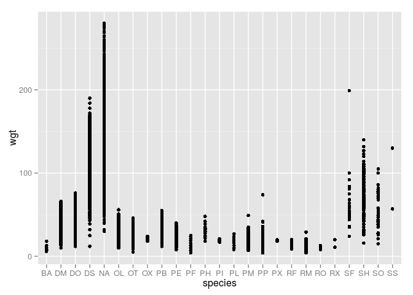
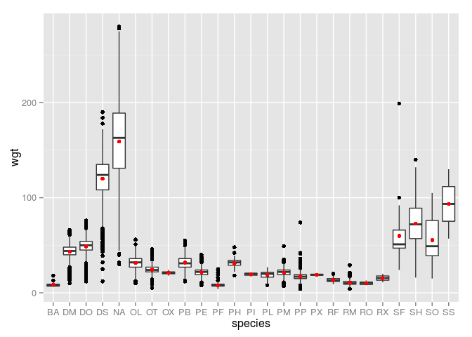
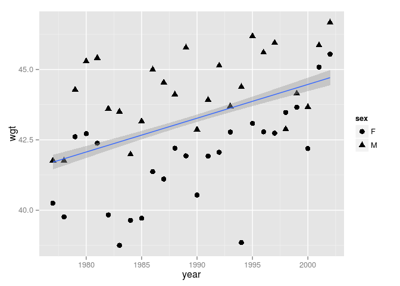
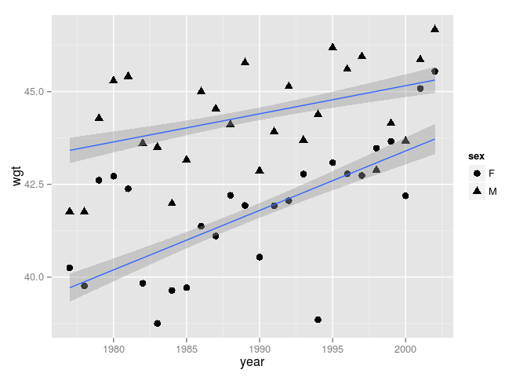
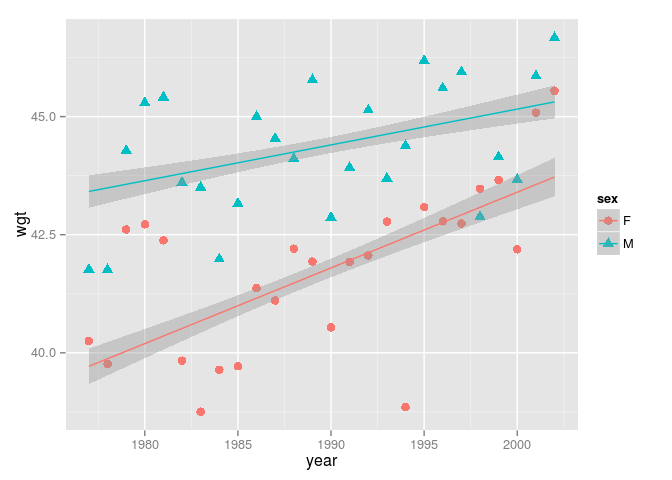
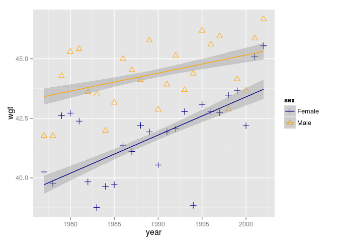
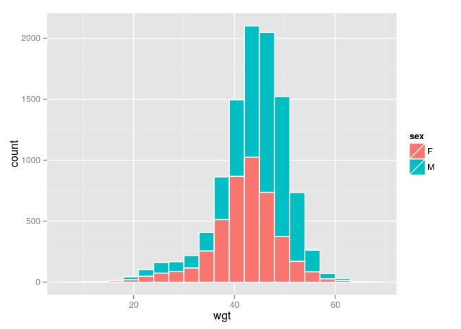
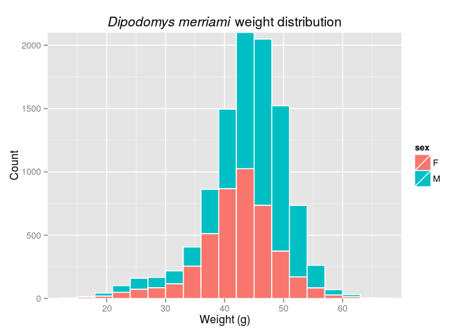
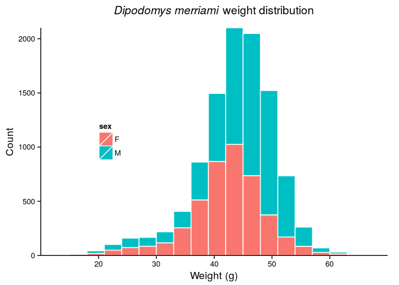
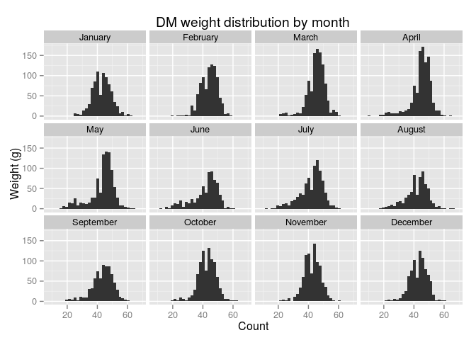

Graphics with ggplot2
=====================

This lesson is a brief overview of the **ggplot2** package, which is a R implementation of the "grammar of graphics". In base R, there are different functions for different types of graphics (`plot`, `boxplot`, `hist`, etc.) and each may have their own specific parameters in addition to general plot options. In contrast, ggplot2 constructs plots one *layer* at a time; for example, the output of a linear regression could be plotted by defining the axes, then adding individual points, tracing the line of best fit, and finally specifying overall layout parameters such as font sizes and background color.

This layered approach allows for highly customizable graphics. Even when a plot requires several lines of code, that code is broken down in simple components that are easy to interpret.

Let's start by loading a few packages along with sample data. We filter our *surveys* dataset to remove rows that have missing values for the species, sex or weight columns. (This is not strictly necessary, but it will prevent ggplot from returning missing values warnings.)

``` r
library(dplyr)
library(ggplot2)
surveys <- read.csv("/nfs/public-data/CSI2015/surveys.csv", na.strings = "")
surveys <- filter(surveys, !is.na(species), !is.na(sex), !is.na(wgt))
```

Constructing layered graphics in ggplot
---------------------------------------

As a first example, this code plots the inviduals' weights by species:

``` r
ggplot(data = surveys, aes(x = species, y = wgt)) + geom_point()
```



In `ggplot`, we specified a data frame (*surveys*) and a number of aesthetic mappings (`aes`). The `aes` function associates variables from that data frame to visual elements in the plot: here, *species* on the x-axis and *wgt* on the y-axis. The `ggplot` function by itself does not plot anything until we add a *geom* layer such as `geom_point`. In this particular case, individual points are hard to distinguish; what could we use instead? (Try `geom_boxplot`.)

Multiple geom layers can be combined in a single plot:

``` r
ggplot(data = surveys, aes(x = species, y = wgt)) + 
  geom_boxplot() +
  geom_point(stat = "summary", fun.y = "mean", color = "red")
```



This `geom_point` layer definition illustrates a couple new features:

-   With `stat = "summary"`, we can plot a summary statistic (defined by `fun.y`) instead of the raw data.
-   Setting `color = red` applies one color to the whole layer. If we want instead to associate color (or some other attribute, like point shape) to a variable, it needs to be specified within an `aes` function.

### Quick plotting with qplot

The `qplot` function provides a shortcut to `ggplot` that looks more like the base R `plot` function, e.g. `qplot(x = species, y = wgt, data = surveys, geom = "boxplot")`. This can be useful to quickly produce simple graphs, especially those with a single geom.

### Exercise

Using `dplyr` and `ggplot` show how the mean weight of individuals of the species *DM* varies across years and between males and females.

Adding and customizing scales
-----------------------------

The code below shows one graph answering the question in the exercise. I added a `geom_smooth` layer that displays a regression line with confidence intervals (95% CI by default). The `method = "lm"` parameter specifies that a linear model is used for smoothing.

``` r
surveys_dm <- filter(surveys, species == "DM")
ggplot(data = surveys_dm, aes(x = year, y = wgt)) + 
  geom_point(aes(shape = sex), size = 3, stat = "summary", fun.y = "mean") +
  geom_smooth(method = "lm")
```



To get separate regression lines for females and males, we could add a *group* aesthetic mapping to `geom_smooth`:

``` r
ggplot(data = surveys_dm, aes(x = year, y = wgt)) + 
  geom_point(aes(shape = sex), size = 3, stat = "summary", fun.y = "mean") +
  geom_smooth(aes(group = sex), method = "lm")
```



Even better would be to distinguish the two lines by color:

``` r
year_wgt <- ggplot(data = surveys_dm, aes(x = year, y = wgt, color = sex)) + 
  geom_point(aes(shape = sex), size = 3, stat = "summary", fun.y = "mean") +
  geom_smooth(method = "lm")
year_wgt
```



Notice that by adding the aesthetic mapping in the `ggplot` command, it is applied to all layers that recognize that aesthetic (color). After saving a graph in a variable (here, `year_wgt`), it is still possible to add new elements to it with the `+` operator. We will now customize the color and point shape scales:

``` r
year_wgt <- year_wgt +
  scale_color_manual(values = c("darkblue", "orange"),
                     labels = c("Female", "Male")) +
  scale_shape_manual(values = c(3, 2),
                     labels = c("Female", "Male"))
year_wgt  
```



The `labels` parameter affects the names displayed in the legend. What happens if the labels provided to the shape and color scales don't match? (Try it.) You can also change the order of legend labels with the `breaks` parameter of the `scale` function.

### Exercise

Create an histogram of the weights of individuals of species *DM* and divide the data by sex. Look at the [documentation](http://docs.ggplot2.org/current/geom_histogram.html) for `geom_histogram` to learn how to customize this graph. Can you make the bars representing males and females display side by side instead of vertically? How can you change the default bin width? Does the `color` parameter work as you would expect, and if not, which other parameter can you use?

Axes, labels and themes
-----------------------

Let's start from the histogram produced for the exercise above.

``` r
histo <- ggplot(data = surveys_dm, aes(x = wgt, fill = sex)) +
  geom_histogram(binwidth = 3, color = "white")
histo
```



We change the title and axis labels with the `labs` function, edit the breaks and limits of the *x*-axis, and remove the "buffer" around the axis limits with `expand = c(0, 0)`.

``` r
histo <- histo + 
  labs(title = expression(paste(italic("Dipodomys merriami"), " weight distribution")),
       x = "Weight (g)", y = "Count") +
  scale_x_continuous(limits = c(10, 70), breaks = c(20, 30, 40, 50, 60), 
                     expand = c(0, 0)) +
  scale_y_continuous(expand = c(0, 0))
histo
```



Note how `expression` is used to italicize part of the title. To learn more about how to add special symbols and formatting to plot labels, see `?plotmath`.

Many plot-level options in `ggplot`, from background color to font sizes, are defined as part of *themes*. As a last step, we change the base theme of the plot to `theme_classic` (a more minimal layout) and set a few options manually with the `theme` function. Try `?theme` for a list of available theme options.

``` r
histo <- histo +
  theme_classic() +
  theme(legend.position = c(0.2, 0.5),  # position relative to plot size (i.e. between 0 and 1)
        plot.title = element_text(face = "bold", vjust = 2),
        axis.title.y = element_text(size = 13, vjust = 1), 
        axis.title.x = element_text(size = 13, vjust = 0))
histo
```



Facets
------

To conclude this overview of ggplot2, here is an example of the use of *facets* to display a grid of plots. To create facets along two categorical variables, use `facet_grid` instead of `facet_wrap`.

``` r
surveys_dm$month <- as.factor(surveys_dm$month)
levels(surveys_dm$month) <- c("January", "February", "March", "April", "May",  
  "June", "July", "August", "September", "October", "November", "December")
ggplot(data = surveys_dm, aes(x = wgt)) +
  geom_histogram() +
  facet_wrap( ~ month) +
  labs(title = "DM weight distribution by month", x = "Count", y = "Weight (g)")
```

    ## stat_bin: binwidth defaulted to range/30. Use 'binwidth = x' to adjust this.
    ## stat_bin: binwidth defaulted to range/30. Use 'binwidth = x' to adjust this.
    ## stat_bin: binwidth defaulted to range/30. Use 'binwidth = x' to adjust this.
    ## stat_bin: binwidth defaulted to range/30. Use 'binwidth = x' to adjust this.
    ## stat_bin: binwidth defaulted to range/30. Use 'binwidth = x' to adjust this.
    ## stat_bin: binwidth defaulted to range/30. Use 'binwidth = x' to adjust this.
    ## stat_bin: binwidth defaulted to range/30. Use 'binwidth = x' to adjust this.
    ## stat_bin: binwidth defaulted to range/30. Use 'binwidth = x' to adjust this.
    ## stat_bin: binwidth defaulted to range/30. Use 'binwidth = x' to adjust this.
    ## stat_bin: binwidth defaulted to range/30. Use 'binwidth = x' to adjust this.
    ## stat_bin: binwidth defaulted to range/30. Use 'binwidth = x' to adjust this.
    ## stat_bin: binwidth defaulted to range/30. Use 'binwidth = x' to adjust this.



Additional information
----------------------

-   [Data visualization with ggplot2 (RStudio cheat sheet)](http://www.rstudio.com/wp-content/uploads/2015/03/ggplot2-cheatsheet.pdf)

-   [Documentation site for ggplot2](http://docs.ggplot2.org)

-   [Cookbook for R - Graphs](http://www.cookbook-r.com/Graphs/) A useful reference on how to customize different graph elements in ggplot2.
