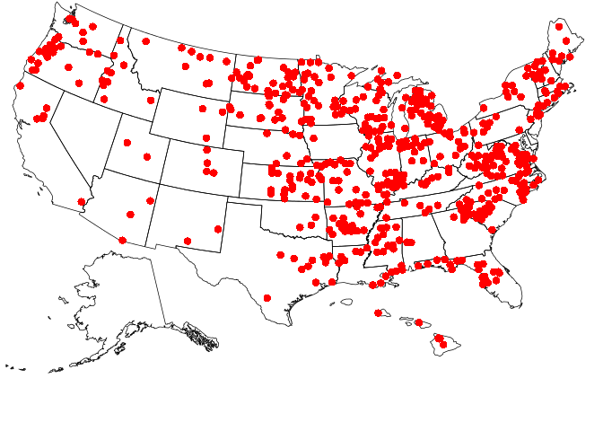

Getting data from the web
=========================

To take advantage the growing number of open data repositories in the natural and social sciences, researchers need tools that automate the process of (1) requesting specific data from a web source and (2) parsing it into a format suitable for analysis.

The format of a data request depends on the application programming interface (API) of the host website. For this tutorial, we will download data from the USGS [BISON](http://bison.usgs.ornl.gov) web service, based on its documented [API](http://bison.usgs.ornl.gov/#api).

We will first use general-purpose R packages to make requests to a web API and parse its output, then we will repeat the same process with the help of a package created specifically for BISON.

Requesting and parsing data from an API
---------------------------------------

In this section, we use the **RCurl** package to send HTTP *GET* requests to the BISON server. The server will return the data in JSON format, which is a piece of text storing information about data objects and attributes in a hierarchical (nested) manner. The **jsonlite** package allows us to convert this JSON text into a R *list* object. Along with XML, which can be parsed by the **XML** package in R, JSON is one of the most common return formats for web APIs.

``` r
library(RCurl)
library(jsonlite)
```

The code below requests the occurrence data for common ragweed (*Ambrosia artemisiifolia*) in the state of Maryland. We first call `URLencode` to make sure the request URL is formatted properly (i.e. replacing spaces with *%20*), then pass the formatted URL to `getURL` which actually sends the request and returns its output. Finally, `fromJSON` parses the JSON data format into a R list. You can use the `str()` function or the "Environment" panel in RStudio to explore the data stored in *bison\_parsed*.

``` r
# BISON search API, documented here: http://bison.usgs.ornl.gov/#api
spc <- "Ambrosia artemisiifolia"
bison_url <- URLencode(paste0("http://bison.usgs.ornl.gov/api/search.json?species=",
                       spc, "&type=scientific_name&state=Maryland"))
bison_out <- getURL(bison_url)
bison_parsed <- fromJSON(bison_out)
```

R packages tailored for specific APIs
-------------------------------------

The method presented above works well for any web API that takes HTTP requests and returns data in one of the standard formats. It still requires the user to be familiar with the peculiarities of each API. Fortunately, custom R packages have been created to interface with many popular data repositories. Such packages encapsulate the tedious work of formatting requests and parsing the output, leading to simpler and clearer user code.

We now repeat the request above, this time using the **rbison** package developed at rOpenSci. (See [this page](https://ropensci.org/tutorials/rbison_tutorial.html) for more information on rbison.) In the `bison` function call, we request a *Ambrosia artemisiifolia* records across the US, with a limit of 1000 records to be returned. We then call `bisonmap` on the output to show the occurrences on a map. Note that `bisonmap` can also display a color-coded map of occurrences by state or county by setting the parameter `tomap` to "state" or "county", respectively.

``` r
library(rbison)
bison_out <- bison(species = "Ambrosia artemisiifolia", count = 1000)
bisonmap(bison_out)
```


