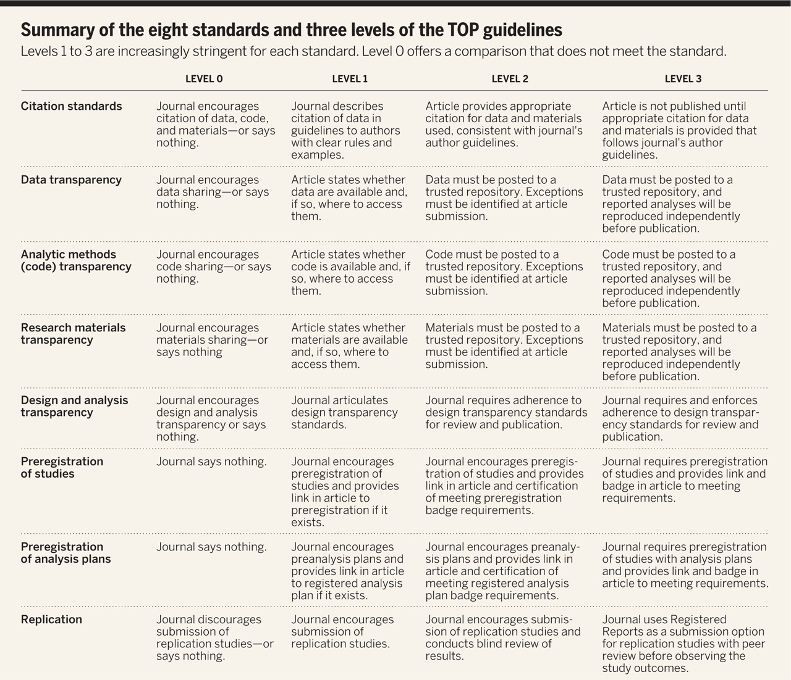
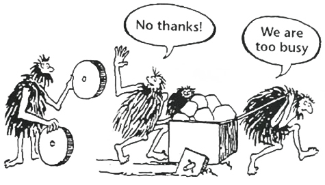
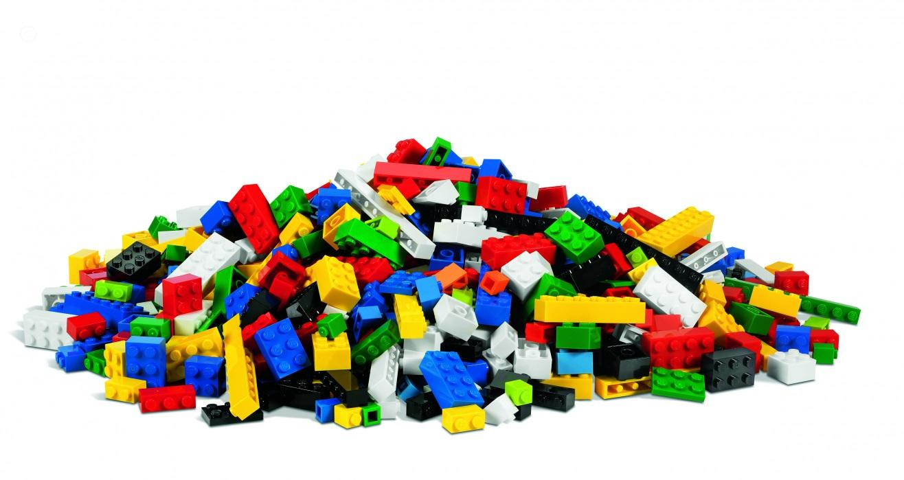
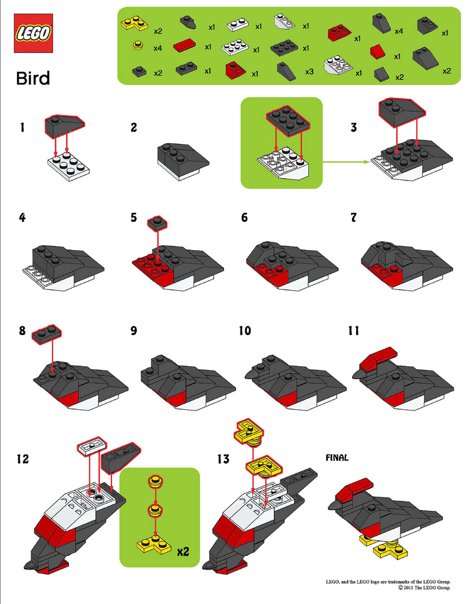
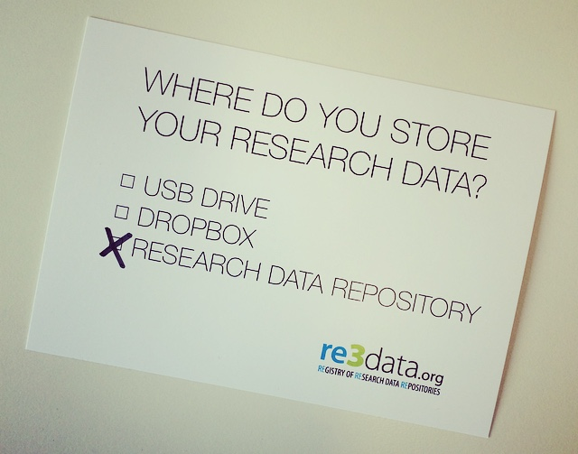

Reproducible Research
===============
author: Kelly Hondula
font-family: 'Helvetica'


Overview
========================================================
incremental: true

- Motivation & context
- General principles
- Survey landscape of tools
- RShiny example

Who is reproducible research for?
===============

<div align="center">


</div>

***
<div align="center">

</div>

Who is reproducible research for?
===============
title:false

<div align="center">

</div>


Who is reproducible research for?
===============

* you, now and in the future
* collaborators
* reviewers & editors

<div align="center">

</div>

What is reproducible research?
===============

<div align="center">

</div>

<small><small>"The goal of reproducible research is to tie specific instructions to data analysis and experimental data so that scholarship can be recreated, better understood and verified."  - Max Kuhn, CRAN Task View: Reproducible Research </small></small>

__Access__, __understanding__, __sharing__


What is reproducible research?
===============
title: false

<br><br>
_i.e._  
__Raw data  +  instructions__

<div align="left">

</div>
***
<div align="right">

</div>


What to share
========================================================
incremental: false

**Archive**
  - starting dataset
  - metadata
  - data cleaning steps
  - analysis scripts
  - source code
  - readme

***
**Share maybe**
  - raw data
  - processed/cleaned data
  - intermediate results

What NOT to share
========================================================
incremental: false

- confidential data
- published material
- pre-existing restrictive licenses
- passwords, private keys

<div align="center">

</div>


Where?
===============
title:false
<div align="center">

</div>


How to choose the appropriate repository?
===============
- is there a domain specific repository?
- what are the backup & replication policies?
- is there a plan for long-term preservation?
- can people find your materials?
- is it citable? (does it provide DOIs)
- is your purpose archival, sharing or publication?

Depositing code and data
========================================================
Payoffs
- Free space for hosting (and paid options)
- Assignment of persistent DOIs
- Tracking citation metrics 

Costs
- Sometimes license restrictions (CC-BY & CC0)
- Limited or no private storage space

Benefits are straightforward
=======================================================
- **Verification & Reliability**: Easier to find and fix bugs. The results you produce today will be the same results you will produce tomorrow.
- **Transparency**: Leads increased citation count, broader impact, improved institutional memory
- **Efficiency**: Reuse allows for de-duplication of effort. Payoff in the (not so) long run
- **Flexibility**: When you don’t 'point-and-click' you gain many new analytic options.

But the limitations are substantial
=======================================================
Technical
- Classified/sensitive/big data
- Nondisclosure agreements & intellectual property 
- Software licensing issues
- Competition
- Neither necessary nor sufficient for correctness (but essential for dispute resolution)

***

Cultural & personal 
- Very few researchers follow even minimal reproducibility standards.
- No-one expects or requires reproducibility 
- No uniform standards of reproducibility, so no established user base
- Inertia & embarassment

Why?
===============
- review "sticks" already talked about: journal policies, NSF/funding agency policies, Congressional mandates
- "carrots" - examples of higher citation, visibility, etc.


When to think about reproducibility?
===============
- things you can do now (file naming, etc.)
- bookmarks and checkpoints in your progress. remember version control tools!
- at publication/submission
- think about it ahead of time!
- knowing that you will be sharing results can make your science better


How? 
===============
Principles and tools
- tools at different stages of publishing process. show good example of the PNAS paper on sprawl
- software being used - even if not open source software, can share the flow diagram like the gis steps
- what to share and what not to share


File organization: a mighty weapon against chaos
==============

These practices are easy to implement now and will payoff greatly as your projects become more complex.

Make a file's name and location VERY INFORMATIVE about what it is, why it exists, and how it relates to other things.

- Machine readable: deliberate use of delimiters, avoid spaces and punctuation, accented characters
- Human readable: contains info on content in some way
- Default ordering; put something numeric first, use ISO 8601 standard for dates YYYY-MM-DD, left pad numbers with zeros

- File formats: Use non-proprietary file formats such as .csv and .txt rather than Word, Excel, PDFs, images

Tools for reproducible research
==============
- github
- figshare
- dryad
- RShiny
- jupyter notebook
- RStudio: File > Compile Notebook


Interactive notebook in the browser, IPython-style
========================================================
```
library(rCharts)
open_notebook()
```


Shiny example
==============
[RStudio Shiny cheatsheet](http://shiny.rstudio.com/images/shiny-cheatsheet.pdf)

More references & resources
========================================================
incremental:false

* [Markdown Quick Reference](http://web.mit.edu/r/current/RStudio/resources/markdown_help.html)
* [Daring Fireball Markdown Basics](http://daringfireball.net/projects/markdown/basics)
* [Markdown Cheat Sheet](https://github.com/adam-p/markdown-here/wiki/Markdown-Cheatsheet#wiki-code)
* [Using R Markdown with RStudio](http://www.rstudio.com/ide/docs/authoring/using_markdown)
* [knitr website](http://yihui.name/knitr/)
* [Markdown example with knitr and rCharts](http://rpubs.com/rchavelas90/9331) by Ricardo Chavelas
* [Registry of Research Data Repositories](http://www.re3data.org/)


