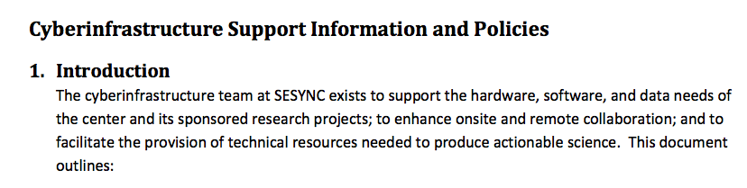

Reproducible Research: who, what, where, why, when & how
===============
author: SESYNC Computational Summer Institute July 2015

Overview
========================================================
incremental: true

- Motivation & context
- Concepts and vocabulary
- General principles
- Survey landscape of tools
- Dissemination example with RShiny

Who is reproducible research for?
===============
type: sub-section

Who is reproducible research for?
===============
incremental: true
title:false

Don't let this be you!

***

Who is reproducible research for?
===============
incremental: true
title:false

***

Who is reproducible research for?
===============
title:false

Who is reproducible research for?
===============
incremental: true

* you, now and in the future
* collaborators
* reviewers & editors
* funding agencies

What is reproducible research?
===============
type: sub-section

Access, understanding, sharing
===============

**give figure citation**

<small>"The goal of reproducible research is to tie specific instructions to data analysis and experimental data so that scholarship can be recreated, better understood and verified."  - Max Kuhn, CRAN Task View: Reproducible Research </small>

What is reproducible research?
===============
title: false

  
_i.e._  
__Raw data  +  instructions__

***

What to share
========================================================
incremental: false

**Archive**
  - starting dataset
  - metadata
  - data cleaning steps
  - analysis scripts
  - source code
  - readme

***
**Share maybe**
  - raw data
  - processed/cleaned data
  - intermediate results

What NOT to share
========================================================
incremental: false

- confidential data
- copyrighted material
- pre-existing restrictive licenses
- your passwords and private keys

Where is reproducible research?
===============
type: sub-section
title:false

How to choose an appropriate repository?
===============
- is there a domain specific repository?
- what are the backup & replication policies?
- is there a plan for long-term preservation?
- can people find your materials?
- is it citable? (does it provide DOIs)
- is your purpose archival, sharing or publication?

Why reproducible research?
===============
type: sub-section

Why?
===============

Increased visibility and citation
===============

***

Piwowar & Vision (2013) “Data reuse and the open data citation advantage.” PeerJ, e175

https://peerj.com/articles/175/

Figure 1: Citation density for papers with and without publicly available microarray data, by year of study publication.

Better research
==================

***

Wicherts et al (2011) “Willingness to Share Research Data Is Related to the Strength of the Evidence and the Quality of Reporting of Statistical Results.” PLoS ONE 6(11): e26828

Figure 1. Distribution of reporting errors per paper for papers from which data were shared and from which no data were shared.

More efficient, less redundant science
=====================

When to think about reproducibility?
===============
type: sub-section

When to think about reproducibility?
===============
- now
- before you start a project
- at publication

File organization: a mighty weapon against chaos
==============

A good project layout helps ensure the

- Integrity of data
- Portability of the project
- Easier to pick the project back up after a break

File organization: a mighty weapon against chaos
==============

Help find and use your files again
==============

- **Machine readable**  
   deliberate use of delimiters, avoid spaces and punctuation, accented characters
- **Human readable**  
  contains info on content in some way
- **Default ordering**  
  put something numeric first, use ISO 8601 standard for dates YYYY-MM-DD, left pad numbers with zeros
- **File formats**  
  Use non-proprietary file formats such as .csv and .txt rather than Word, Excel, PDFs, images

Tools for reproducible research
==============

Shiny example
==============

[RStudio Shiny cheatsheet](http://shiny.rstudio.com/images/shiny-cheatsheet.pdf)

More references & resources
========================================================
incremental:false

* [Markdown Quick Reference](http://web.mit.edu/r/current/RStudio/resources/markdown_help.html)
* [Daring Fireball Markdown Basics](http://daringfireball.net/projects/markdown/basics)
* [Markdown Cheat Sheet](https://github.com/adam-p/markdown-here/wiki/Markdown-Cheatsheet#wiki-code)
* [Using R Markdown with RStudio](http://www.rstudio.com/ide/docs/authoring/using_markdown)
* [knitr website](http://yihui.name/knitr/)
* [Markdown example with knitr and rCharts](http://rpubs.com/rchavelas90/9331) by Ricardo Chavelas

More references & resources
===============
title:false
* [Registry of Research Data Repositories](http://www.re3data.org/)
* http://nicercode.github.io/blog/2013-04-05-projects/
* http://www.carlboettiger.info/2012/05/06/research-workflow.html
* http://software-carpentry.org/v4/data/mgmt.html
* http://reproducible-science-curriculum.github.io/2015-06-01-reproducible-science-idigbio/checklist.html

